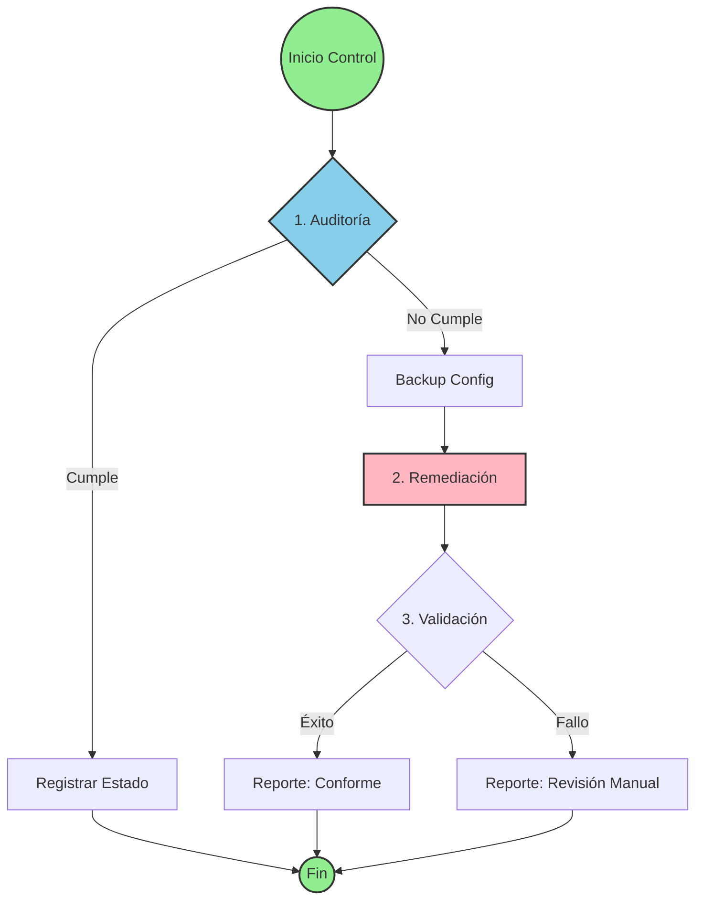

# Playbooks de Remediación CIS Benchmark

## Resumen Ejecutivo

Este repositorio contiene playbooks de Ansible diseñados para automatizar la implementación de controles de seguridad basados en los estándares **CIS Benchmark** (Center for Internet Security) para sistemas operativos empresariales. Los playbooks garantizan el cumplimiento de las mejores prácticas de seguridad de la industria mediante la remediación automatizada de configuraciones.

## Alcance de los Playbooks

El repositorio incluye playbooks para las siguientes plataformas:

| Sistema Operativo | Versión Benchmark | Nivel | Controles |
|-------------------|-------------------|-------|-----------|
| **Red Hat Enterprise Linux 8** | v3.1.1 | Level 1 - Server | Configuración completa |
| **Red Hat Enterprise Linux 7** | v3.1.1 | Level 1 - Server | 12,712 líneas de configuración |
| **Red Hat Enterprise Linux 6** | Latest | Level 1 - Server | Configuración completa |
| **Ubuntu Linux 20.04 LTS** | Latest | Level 1 | Hardening Base |
| **Oracle Solaris 11** | v1.1.4 | Level 1 | 5,264 líneas de configuración |

## Características Principales

### 🔒 Seguridad Empresarial
- **Cumplimiento normativo**: Alineación con estándares CIS, NIST 800-53, PCI-DSS, DISA-STIG
- **Hardening automatizado**: Configuración de seguridad consistente y repetible
- **Auditoría integrada**: Registro detallado de estados pre y post remediación

### 🎯 Controles Implementados

Los playbooks cubren áreas críticas de seguridad:

- **Gestión de Servicios**: Deshabilitación de servicios innecesarios (telnet, XDMCP)
- **Protección de Red**: Configuración de parámetros TCP/IP, ICMP, IPv4/IPv6
- **Autenticación y Acceso**: Políticas de contraseñas, banners de login, sudo
- **Integridad del Sistema**: AIDE (Advanced Intrusion Detection Environment)
- **Actualizaciones**: Verificación GPG de paquetes
- **Protección de Memoria**: Stack protection (NX heap/stack)
- **Auditoría**: Logging centralizado y trazabilidad

### 📊 Arquitectura de Remediación



## Implementación

### Requisitos Previos

- **Ansible**: Versión 2.9 o superior
- **Acceso privilegiado**: Usuario con permisos sudo/root en hosts objetivo
- **Conectividad SSH**: Configuración de claves SSH para hosts remotos
- **Python**: Versión 2.7+ o 3.5+ en hosts gestionados

### Estructura de Variables

Los playbooks utilizan variables parametrizadas para flexibilidad:

```yaml
# Ejemplo: Red Hat Enterprise Linux 7
vars:
  var_password_pam_minlen: "14"
  var_accounts_maximum_age_login_defs: "90"
  sshd_idle_timeout_value: "900"
  rsyslog_remote_loghost_address: "logcollector"
  var_selinux_state: "enforcing"
```

### Ejecución Básica

```bash
# Ejecutar playbook completo
ansible-playbook Red_Hat_Enterprise_Linux_7_Benchmark.yml

# Ejecutar en hosts específicos
ansible-playbook Red_Hat_Enterprise_Linux_7_Benchmark.yml \
  --extra-vars "target=production_servers"

# Ejecutar controles específicos por tags
ansible-playbook Red_Hat_Enterprise_Linux_7_Benchmark.yml \
  --tags "package_aide_installed,ensure_gpgcheck_globally_activated"

# Modo de verificación (sin cambios)
ansible-playbook Red_Hat_Enterprise_Linux_7_Benchmark.yml --check
```

### Inventario de Hosts

Crear archivo `inventory.ini`:

```ini
[rhel7_servers]
server01.example.com
server02.example.com

[solaris11_servers]
solaris01.example.com
solaris02.example.com

[all:vars]
ansible_user=ansible_admin
ansible_become=yes
ansible_become_method=sudo
```

## Ejemplos de Controles

### Control CIS 2.12 - Deshabilitar Servicio Telnet (Solaris)
```yaml
- Audita el estado actual del servicio telnet
- Deshabilita el servicio si está activo
- Verifica que no hay conexiones en puerto 23
- Registra cambios en /var/log/cis_remediation.log
```

### Control CIS 3.1 - Protección contra ICMP Broadcast
```yaml
- Configura _respond_to_echo_broadcast=0
- Previene ataques de amplificación ICMP
- Valida configuración persistente y actual
```

### AIDE - Detección de Intrusiones (RHEL)
```yaml
- Instalación de paquete AIDE
- Construcción de base de datos inicial
- Configuración de escaneos periódicos (cron)
- Alertas automáticas de cambios no autorizados
```

## Auditoría y Trazabilidad

### Logs de Auditoría

Cada playbook genera registros detallados:

```
[2026-02-13T14:11:37-05:00] CIS 2.12 - Estado PRE: enabled
[2026-02-13T14:11:45-05:00] CIS 2.12 - Estado POST: disabled - CONFORME
[2026-02-13T14:12:03-05:00] CIS 3.1 - Estado PRE: current=1, persistent=1
[2026-02-13T14:12:08-05:00] CIS 3.1 - Estado POST: current=0, persistent=0 - CONFORME
```

### Reportes de Cumplimiento

Los playbooks incluyen assertions que generan reportes de éxito/fallo:

```
✓ Validación exitosa: Servicio telnet deshabilitado
✓ Validación exitosa: Respuesta a broadcast ICMP echo deshabilitada
✓ Validación exitosa: Protección de stack habilitada (nxheap y nxstack)
```

## Gestión de Riesgos

### Estrategias de Mitigación

| Estrategia | Descripción | Uso |
|------------|-------------|-----|
| `disable_strategy` | Deshabilitación de servicios | Servicios innecesarios |
| `enable_strategy` | Habilitación de controles | AIDE, GPG check |
| `restrict_strategy` | Restricción de permisos | Sudo, archivos críticos |
| `configure_strategy` | Configuración de parámetros | Banners, permisos |

### Niveles de Severidad

- **High Severity**: Controles críticos (GPG check, XDMCP, stack protection)
- **Medium Severity**: Controles importantes (AIDE, banners, sudo logging)
- **Low Severity**: Controles complementarios (configuraciones menores)

## Mejores Prácticas de Implementación

### 1. Entorno de Pruebas
```bash
# Siempre probar primero en desarrollo
ansible-playbook playbook.yml --limit dev_servers --check
```

### 2. Ejecución Gradual
```bash
# Implementar por fases usando tags
ansible-playbook playbook.yml --tags "phase1_services"
ansible-playbook playbook.yml --tags "phase2_network"
ansible-playbook playbook.yml --tags "phase3_authentication"
```

### 3. Backups Automáticos
Los playbooks crean backups automáticos de archivos críticos:
```yaml
backup: true
dest: "{{ file }}.backup.{{ ansible_date_time.epoch }}"
```

### 4. Validación Continua
```bash
# Ejecutar periódicamente para verificar drift
ansible-playbook playbook.yml --check --diff
```

## Cumplimiento Normativo

Los playbooks están alineados con múltiples frameworks:

- **CIS Benchmark**: Estándar principal de referencia
- **NIST 800-53**: Controles de seguridad federales (AC, CM, SI, SC)
- **PCI-DSS**: Requisitos 6.2, 10.2.1.5, 11.5
- **DISA-STIG**: Guías técnicas de implementación de seguridad
- **CJIS**: Criminal Justice Information Services (5.10.x)

## Mantenimiento y Actualización

### Versionamiento
- Los playbooks están versionados según el benchmark CIS correspondiente
- Revisar actualizaciones trimestrales de CIS Benchmark
- Mantener sincronización con versiones de OS soportadas

### Personalización
Para adaptar a requisitos organizacionales:

1. Modificar variables en sección `vars:`
2. Ajustar valores de timeout, longitud de contraseñas, etc.
3. Personalizar banners con mensajes corporativos
4. Configurar servidores de logging centralizados

## Soporte y Contacto

Para consultas sobre implementación o personalización de playbooks:

- **Documentación CIS**: https://www.cisecurity.org/cis-benchmarks
- **Ansible Documentation**: https://docs.ansible.com
- **Logs de Auditoría**: `/var/log/cis_remediation.log`

---

## Licencia y Disclaimer

Estos playbooks implementan controles basados en CIS Benchmarks. Se recomienda:

- Revisar cada control antes de implementación en producción
- Realizar pruebas exhaustivas en entornos de desarrollo
- Mantener backups de configuraciones antes de remediación
- Validar compatibilidad con aplicaciones empresariales

**Última actualización**: Febrero 2026  
**Versión del repositorio**: 1.0
